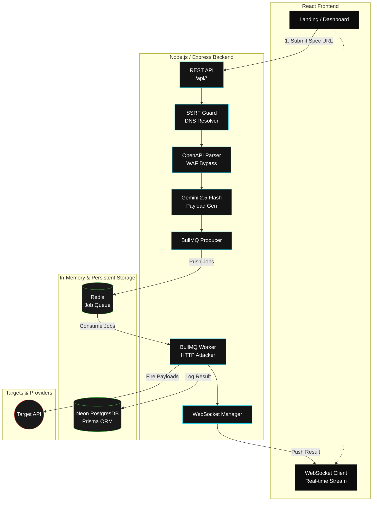

# 🔮 Onyx — Deep Dive Workflow Guide

A complete architectural breakdown of how every piece of this project works, from the moment you paste a URL to the final attack result streaming to your dashboard.

---

## 📑 Table of Contents

1. [What is Onyx?](#1-what-is-onyx)
2. [What Can I Paste? (OpenAPI / Swagger Explained)](#2-what-can-i-paste-openapi--swagger-explained)
3. [The Full Flow (Step by Step)](#3-the-full-flow-step-by-step)
4. [Security & Resilience Layers 🛡️](#4-security--resilience-layers-)
5. [Docker — The Redis Engine](#5-docker--the-redis-engine)
6. [BullMQ — The Job Queue System](#6-bullmq--the-job-queue-system)
7. [Gemini AI — The Payload Brain](#7-gemini-ai--the-payload-brain)
8. [Prisma & PostgreSQL — Persistent Logging](#8-prisma--postgresql--persistent-logging)
9. [WebSockets — Live Telemetry](#9-websockets--live-telemetry)
10. [Architecture Diagram](#10-architecture-diagram)
11. [Startup Commands (Quick Reference)](#11-startup-commands-quick-reference)

---

## 1. What is Onyx?

Onyx is an **AI-powered API vulnerability testing engine**. You provide a link to any API's documentation (an OpenAPI/Swagger spec), and it autonomously:

1. **Parses** every endpoint the API exposes (e.g., `POST /users/login`, `GET /products/{id}`).
2. **Generates** malicious schema-aware payloads using Google's Gemini AI — synthesizing SQL injection strings, XSS scripts, oversized integers, and logic bypass vectors.
3. **Fires** those payloads at the target API using a highly concurrent, rate-limited distributed queue.
4. **Streams** the results live to your dashboard via WebSockets, instantly alerting you to `500 Internal Server Errors` or data leaks.

Think of it as a relentless **hacker simulation bot-net** that stress-tests your infrastructure before deployment.

---

## 2. What Can I Paste? (OpenAPI / Swagger Explained)

### The API Blueprint

Every modern API has a **machine-readable documentation file** that describes all its endpoints, expected parameters, and response formats. This is written in **OpenAPI** (formerly Swagger).

> [!TIP]
> Most APIs document their spec at common endpoints like `/swagger.json`, `/openapi.json`, or `/v2/api-docs`.

### Validation Rules

| ✅ Valid Targets                              | ❌ Invalid Targets                             |
| :-------------------------------------------- | :--------------------------------------------- |
| `https://petstore.swagger.io/v2/swagger.json` | `https://google.com` (HTML website)            |
| `https://api.example.com/openapi.json`        | `http://192.168.1.5/api` (Blocked internal IP) |
| `https://httpbin.org/spec.json`               | `https://github.com/repo` (Not a JSON spec)    |

> [!IMPORTANT]
> **SSRF Protection strictly enforced.** Onyx runs active DNS resolution checks against user-provided URLs. Any URL resolving to a `localhost`, `10.x.x.x`, `172.16.x.x`, or `192.168.x.x` address will be instantly blocked to protect the internal server architecture.

---

## 3. The Full Flow (Step by Step)

Here is the exact lifecycle of a chaotic test run from the moment you hit **"Start Testing"**:

```text
YOU (Browser)                           ONYX SERVER                         EXTERNAL
─────────────                           ───────────                         ────────
   │                                        │                                  │
   │  1. Paste URL, click button            │                                  │
   │──────────────────────────────────────► │                                  │
   │        POST /api/test-runs             │                                  │
   │        { specUrl: "https://..." }      │                                  │
   │                                        │                                  │
   │                                        │  2. SSRF Check & WAF Bypass      │
   │                                        │─────────────────────────────────►│
   │                                        │     Spoof Chrome User-Agent      │
   │                                        │     GET https://target/spec.json │
   │                                        │◄─────────────────────────────────│
   │                                        │                                  │
   │                                        │  3. Parse spec → Extract routes  │
   │                                        │     (POST /pet, GET /user)       │
   │                                        │                                  │
   │                                        │  4. AI Payload Synthesis         │
   │                                        │     → Ask Gemini for 20 payloads │
   │                                        │     → Fallback to static if fail │
   │                                        │                                  │
   │                                        │  5. BullMQ Queue Dispatch        │
   │                                        │     → Store 100+ jobs in Redis   │
   │                                        │                                  │
   │  6. WebSocket subscription             │                                  │
   │◄─────────────────────────────────────  │                                  │
   │     "SUBSCRIBE to test run XYZ"        │                                  │
   │                                        │                                  │
   │                                        │  7. Worker picks job from queue  │
   │                                        │     (Rate limited to max 5/sec)  │
   │                                        │─────────────────────────────────►│
   │                                        │     POST /pet (SQLi Payload)     │
   │                                        │◄─────────────────────────────────│
   │                                        │     Response: 500 Server Error   │
   │                                        │                                  │
   │  8. Live telemetry streamed via WS     │                                  │
   │◄─────────────────────────────────────  │                                  │
   │     { statusCode: 500, type: "SQLI",   │                                  │
   │       endpoint: "/pet", latency: 142 } │                                  │
   │                                        │                                  │
   │  9. Dashboard visually updates         │                                  │
   │     (Metric counters tick up)          │                                  │
```

---

## 4. Security & Resilience Layers 🛡️

Onyx operates in hostile environments. It is built with several defensive and offensive mechanisms:

1. **WAF Bypass Engine**: Many APIs sit behind Cloudflare or AWS WAFs that block automated bots fetching their `swagger.json`. Onyx uses intelligent header spoofing (mimicking modern Chrome macOS setups) to slip past bot-protection during the parsing phase.
2. **DNS-Resolving SSRF Guard**: A malicious user could submit `http://169.254.169.254` (AWS Metadata) or `http://localhost:6379` to attack the server itself. Onyx resolves the DNS of every target URL and aborts the pipeline if the IP targets private ranges.
3. **Strict Rate Limiting**: The attack creation endpoints are limited to 5 test runs per hour per IP to prevent Gemini API credit drain.
4. **Mandatory JWT Secrets**: The application refuses to boot if `JWT_SECRET` is missing in the environment, actively preventing deployment with default/weak cryptographic keys.

---

## 5. Docker — The Redis Engine

We rely on **Redis** for blazingly fast in-memory queue management. Instead of native installations, we use an Alpine Docker container:

```bash
docker compose up redis -d
```

This isolates the 30MB Redis environment, preventing port routing conflicts and keeping local development pristine.

_(Note: We do not containerize PostgreSQL. We rely on Neon Serverless Postgres for production-parity remote data persistence)._

---

## 6. BullMQ — The Job Queue System

If Onyx generates 500 attack payloads, looping through them synchronously would stall the V8 engine and trigger rate-limits on the target API.

Enter **BullMQ**:

- **Concurrency Caps**: Limits how many workers process attacks simultaneously.
- **Fault Tolerance**: If the Node server crashes mid-attack, the jobs survive in Redis and resume upon restart.
- **Granular Retries**: Network timeouts (like `ECONNRESET`) can trigger automatic job retries before marking an attack as failed.

---

## 7. Gemini AI — The Payload Brain

Google's **Gemini 2.5 Flash** replaces static wordlists with dynamic, schema-aware intelligence.

**The Prompt**: It is instructed to act as a 15-year Senior Penetration Tester.
**The Output**: It generates exactly 20 JSON payloads covering SQLi, NoSQLi, XSS, Broken Auth, Boundary Overflows, and Path Traversals — meticulously formatted to match the exact data types requested by the endpoint's schema.

> [!NOTE]
> **Graceful Degradation**: If the Gemini API is unreachable or rate-limited, Onyx instantly catches the exception and falls back to a locally hardcoded array of 35 heuristically-proven payloads, guaranteeing the attack pipeline never stalls.

---

## 8. Prisma & PostgreSQL — Persistent Logging

Every single attack executed by a worker is persisted via **Prisma ORM** into a remote **Neon PostgreSQL** database.

```text
TestRun 1 ───► M TargetEndpoints 1 ───► M AttackLogs
```

This strict relational logging allows you to exit the dashboard midway through an attack and pull up the full historical report days later on the `/history` route.

---

## 9. WebSockets — Live Telemetry

HTTP polling is too slow and resource-heavy for real-time attack monitoring. Onyx establishes a full-duplex persistent `ws://` connection upon loading the Dashboard.

As BullMQ workers complete an HTTP attack, they push the `{ statusCode, latency, payload }` directly to the `WsManager` singleton class, which instantly broadcasts it to the authenticated client's active room. React state updates locally, creating a live, streaming terminal experience.

---

## 10. Architecture Diagram



---

## 11. Startup Commands (Quick Reference)

```bash
# Terminal 1 — Start the Redis Queue Engine
cd Onyx
docker compose up redis -d

# Terminal 2 — Init Backend
cd server
npx prisma db push   # Sync Neon DB schema
npm run dev

# Terminal 3 — Init Frontend
cd client
npm run dev
```

> [!CAUTION]
> **Environment Must-Haves**: Your `server/.env` **must** contain a `JWT_SECRET` string, or the Express server will intentionally crash on boot to prevent insecure deployments.
