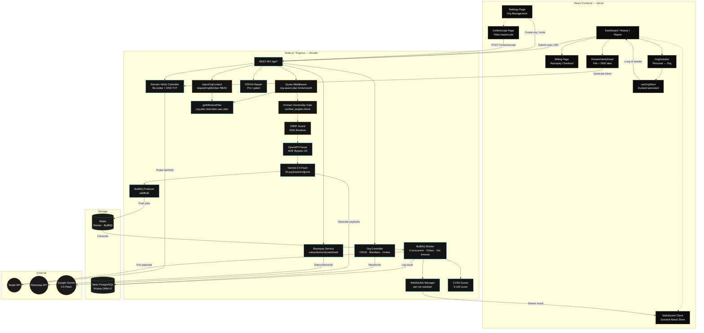

# 🔮 Onyx — Deep Dive Workflow Guide

A complete architectural breakdown of how every piece of this project works — from the moment you paste a URL to the final attack result streaming to your dashboard.

> Last updated: 2026-06-17 | Reflects Feature #2 — Organization / Multi-Tenancy

---

## 📑 Table of Contents

1. [What is Onyx?](#1-what-is-onyx)
2. [What Can I Paste?](#2-what-can-i-paste)
3. [Domain Ownership Verification](#3-domain-ownership-verification)
4. [The Full Attack Flow](#4-the-full-attack-flow)
5. [Security & Resilience Layers](#5-security--resilience-layers)
6. [Organization / Multi-Tenancy](#6-organization--multi-tenancy)
7. [Billing & Plan System](#7-billing--plan-system)
8. [BullMQ — The Job Queue](#8-bullmq--the-job-queue)
9. [Gemini AI — The Payload Brain](#9-gemini-ai--the-payload-brain)
10. [CVSS Severity Scoring](#10-cvss-severity-scoring)
11. [Prisma & PostgreSQL — Persistent Logging](#11-prisma--postgresql--persistent-logging)
12. [WebSockets — Live Telemetry](#12-websockets--live-telemetry)
13. [Architecture Diagram](#13-architecture-diagram)
14. [Startup Commands](#14-startup-commands)
15. [Environment Variables](#15-environment-variables)

---

## 1. What is Onyx?

Onyx is an **AI-powered API vulnerability testing engine**. You provide a link to any API's documentation (an OpenAPI/Swagger spec), and it autonomously:

1. **Verifies** you own the target domain before firing a single request.
2. **Parses** every endpoint the API exposes (`POST /users/login`, `GET /products/{id}`, etc.).
3. **Generates** malicious schema-aware payloads using Google Gemini 2.5 Flash — SQL injection, XSS, auth bypass, path traversal, oversized payloads, and more.
4. **Fires** those payloads at the target API via a highly concurrent, rate-limited distributed queue (BullMQ + Redis).
5. **Scores** each result with CVSS-inspired severity (CRITICAL / HIGH / MEDIUM / LOW / INFO) and computes an overall API security score (0–100).
6. **Streams** everything live to your dashboard via WebSockets, with PDF report export on Pro+ plans.

---

## 2. What Can I Paste?

### The API Blueprint

Every modern API has a machine-readable documentation file describing all its endpoints, parameters, and response formats. This is written in **OpenAPI** (formerly Swagger).

> [!TIP]
> Most APIs document their spec at paths like `/swagger.json`, `/openapi.json`, or `/v2/api-docs`.

### Validation Rules

| ✅ Valid Targets | ❌ Invalid / Blocked |
|:----------------|:--------------------|
| `https://petstore.swagger.io/v2/swagger.json` | `https://google.com` (HTML, not a spec) |
| `https://api.example.com/openapi.json` | `http://192.168.1.5/api` (private IP — SSRF blocked) |
| `https://httpbin.org/spec.json` | Any domain you don't own (domain verification required) |

> [!IMPORTANT]
> **SSRF Protection is strictly enforced.** Onyx performs DNS resolution on every URL. Any hostname resolving to `127.x`, `10.x`, `172.16–31.x`, `192.168.x`, `169.254.x`, `.local`, or `.internal` is instantly blocked.

---

## 3. Domain Ownership Verification

Before Onyx fires a single payload, you must prove you own the target domain. This is both a legal protection and a trust layer.

### Why this exists

Without verification, anyone could point Onyx at `https://someones-bank-api.com/openapi.json`. The verification step closes this liability.

### Two verification methods

**Method A — File probe (fastest)**

Place a file at:
```
https://your-domain.com/.well-known/onyx-verify.txt
```
The file contents must exactly equal the token Onyx generated for you (e.g., `onyx-verify-a3f9c2...`).

**Method B — DNS TXT record (no file hosting needed)**

Add a TXT record to your domain's DNS:
```
Record name:  _onyx-verify.your-domain.com
Record value: onyx-verify-a3f9c2...
```

### Verification flow

```
Dashboard                        Server                       Target Domain
─────────                        ──────                       ─────────────
  │ Paste URL                        │                              │
  │ → "Verify Domain" button appears │                              │
  │                                  │                              │
  │ POST /api/verify-target          │                              │
  │ { specUrl: "https://..." }  ───► │                              │
  │                                  │ Generate token               │
  │ ◄─── { domain, token }           │ Store in verified_targets    │
  │                                  │                              │
  │ [User places file or DNS record] │                              │
  │                                  │                              │
  │ POST /api/verify-target/check ──►│                              │
  │ { domain }                       │ GET /.well-known/onyx-verify.txt ──►│
  │                                  │                              │
  │                                  │◄── token matches             │
  │                                  │ SET verifiedAt = now()       │
  │ ◄─── { verified: true }          │                              │
  │                                  │                              │
  │ Execute Run button unlocks       │                              │
```

### What gets blocked without verification

```http
POST /api/test-runs
→ 403 DOMAIN_NOT_VERIFIED
{
  "error": "DOMAIN_NOT_VERIFIED",
  "domain": "target-api.com",
  "message": "You must verify ownership of \"target-api.com\" before scanning it."
}
```

### Persistence

- Verified domains are stored per-user in the `verified_targets` DB table.
- Re-visiting the Dashboard pre-checks your verified domains — no re-verification needed.
- Changing the URL to a different domain resets verification state automatically.

---

## 4. The Full Attack Flow

End-to-end lifecycle from clicking "Execute Run" to receiving live results:

```
YOU (Browser)                     ONYX SERVER                      EXTERNAL
─────────────                     ───────────                      ────────
     │                                 │                               │
  1. Domain already verified           │                               │
     (DomainVerifyPanel shows ✓)       │                               │
     │                                 │                               │
  2. Click "Execute Run"               │                               │
     POST /api/test-runs ─────────────►│                               │
     { specUrl }                       │                               │
                                       │  3. SSRF check (DNS resolve)  │
                                       │  4. Domain ownership gate     │
                                       │     (verified_targets lookup) │
                                       │                               │
                                       │  5. Create TestRun in DB      │
                                       │     status: PARSING           │
  ◄── 201 { testRunId } ───────────────│                               │
                                       │                               │
  3. Subscribe via WebSocket           │                               │
     ws://server/ws?token=JWT ────────►│                               │
     SUBSCRIBE { testRunId } ─────────►│                               │
                                       │                               │
                                       │  6. [500ms delay — WS sync]   │
                                       │                               │
                                       │  7. Phase: PARSING            │
                                       │     WAF-bypass GET spec ─────►│
                                       │◄── OpenAPI JSON ──────────────│
                                       │     Extract all endpoints     │
                                       │                               │
                                       │  8. Phase: GENERATING         │
                                       │     Ask Gemini for 20         │
                                       │     payloads per endpoint     │
                                       │     (fallback: 35 static)     │
                                       │                               │
                                       │  9. Phase: ATTACKING          │
                                       │     addBulk() → Redis queue   │
                                       │     BullMQ workers consume    │
                                       │     (5 concurrent, 10/sec)    │
                                       │                               │
                                       │  10. Worker fires payload ───►│
                                       │◄── HTTP response ─────────────│
                                       │     Log to AttackLog in DB    │
                                       │     Compute CVSS severity     │
                                       │                               │
  ◄── WS: ATTACK_RESULT ─────────────  │                               │
  { method, endpoint, status,          │                               │
    payload, severity, latency }       │                               │
     │                                 │                               │
  Dashboard metrics update live        │                               │
  (payloads fired, criticals, score)   │                               │
                                       │  11. All jobs complete        │
                                       │      status: COMPLETED        │
                                       │      Compute overall score    │
  ◄── WS: TEST_RUN_STATUS ───────────  │                               │
  { status: "COMPLETED",               │                               │
    overallScore: 72,                  │                               │
    scoreLabel: "MEDIUM" }             │                               │
```

---

## 5. Security & Resilience Layers

### SSRF Guard (`ssrf-guard.ts`)
Performs DNS resolution on every user-supplied URL before any outbound HTTP request. Throws if the resolved IP falls in:
- Loopback: `127.x.x.x`, `::1`
- Private: `10.x`, `172.16–31.x`, `192.168.x`
- Link-local: `169.254.x.x`, `fe80::`
- Cloud metadata: `0.x.x.x`
- Internal hostnames: `.local`, `.internal`, `localhost`, `0.0.0.0`

Applied at two points: spec fetch + every worker attack job.

### Domain Ownership Gate
New as of Jun 17, 2026. Every `createTestRun` call checks `verified_targets` for a matching `(userId, domain)` row with `verifiedAt IS NOT NULL`. No verified record = 403.

### WAF Bypass (OpenAPI fetch)
The spec fetch spoofs a Chrome macOS User-Agent to bypass Cloudflare/AWS WAF bot detection during the parsing phase.

### Rate Limiting (`express-rate-limit`)
- Auth endpoints (`/api/auth/*`): 5 requests/minute per IP
- Attack endpoints (`/api/test-runs`, `/api/attack`): 5 requests/hour per IP

### Plan Quota (`quota.middleware.ts`)
Per-calendar-month check against plan limits before any test run is created. Returns `429 QUOTA_EXCEEDED` with `upgradeUrl`.

### JWT Security
- 7-day token expiry
- Server hard-crashes on boot if `JWT_SECRET` is undefined (prevents weak-key deployments)
- WebSocket connections authenticated via `?token=` query param, ownership-verified per subscription

### Helmet
HTTP security headers (CSP, HSTS, X-Frame-Options, etc.) applied globally.

---

## 6. Organization / Multi-Tenancy

### Concept

A user can belong to multiple organizations. Each org has a plan, a member roster, and owns test runs. When a user activates an org context, all quotas, test runs, and plan limits switch to the org rather than the individual.

### Context injection

Every protected request can carry an `x-org-id` header. The `injectOrgContext` middleware reads it, verifies the user is a member, and attaches `req.orgId` and `req.orgMember` for downstream handlers.

```
Request
  x-org-id: <uuid>
       │
       ▼
injectOrgContext middleware
  • Look up OrgMember(orgId, userId)
  • 403 if not a member
  • req.orgId = orgId
  • req.orgMember = { role, ... }
       │
       ▼
requireOrgMember('ADMIN') guard (optional, per route)
  • ROLE_RANK: OWNER=3, ADMIN=2, VIEWER=1
  • 403 if rank < required
       │
       ▼
Handler
```

The frontend `useOrgStore` (Zustand, persisted) holds the active org. The Axios interceptor reads it and injects `x-org-id` on every request automatically.

### Creating an org and inviting members

```
User (Settings page)            Server
────────────────────            ──────
POST /api/orgs                 ─────►  Generate slug from name
{ name: "Acme Corp" }                  Create Organization row
                                       Create OrgMember(role: OWNER)
◄───── { org }

POST /api/orgs/:id/invites     ─────►  Create OrgInvite(token, expiresAt+7d)
{ email, role: "VIEWER" }              Return inviteUrl = CLIENT_URL/invite/accept?token=...
◄───── { invite: { inviteUrl } }

[User copies link, sends to colleague]

POST /api/invites/accept       ─────►  Verify token not expired, not used
{ token }                              Create OrgMember(role from invite)
                                       Mark acceptedAt = now()
◄───── { orgId, role }
```

### Plan resolution

`getEffectivePlan(userId, orgId?)` — org plan always takes precedence over user's personal plan. Quota middleware and test-run creation both call this function.

```
orgId present?
  YES → fetch org.plan → use org plan (ignore personal plan)
  NO  → fetch user.plan → use personal plan
```

### RBAC summary

| Route | Min role |
|-------|----------|
| GET /orgs/:id | VIEWER |
| GET /orgs/:id/members | VIEWER |
| POST /orgs/:id/invites | ADMIN |
| GET /orgs/:id/invites | ADMIN |
| DELETE /orgs/:id/invites/:id | ADMIN |
| PATCH /orgs/:id/members/:userId | OWNER |
| DELETE /orgs/:id/members/:userId | OWNER |
| PATCH /orgs/:id | OWNER |
| DELETE /orgs/:id | OWNER |

`guardLastOwner` is called before any role change or member removal to prevent an org being left without an owner.

### Org-scoped test runs

```
GET  /api/test-runs   with x-org-id  →  WHERE orgId = :orgId
GET  /api/test-runs   without header  →  WHERE userId = :userId
POST /api/test-runs   with x-org-id  →  TestRun.orgId = orgId
```

Deleting an org sets `TestRun.orgId = NULL` (onDelete: SetNull) — runs are preserved, just unlinked.

---

## 7. Billing & Plan System

### Plan tiers

| Plan | Price | Test Runs/mo | Endpoints/run | PDF Reports |
|------|-------|-------------|--------------|-------------|
| FREE | $0 | 5 | 10 | ❌ |
| PRO | $9/mo | 100 | 50 | ✅ |
| TEAM | $18/mo | 500 | Unlimited | ✅ |
| ENTERPRISE | Custom | Unlimited | Unlimited | ✅ |

### Razorpay subscription flow

```
Frontend                      Server                      Razorpay
────────                      ──────                      ────────
  │ Click upgrade plan           │                            │
  │ POST /api/billing/subscribe ►│                            │
  │ { planId }                   │ Create subscription ──────►│
  │                              │◄── { subscriptionId, shortUrl }
  │◄── { subscriptionId, shortUrl }                          │
  │                              │                            │
  │ Open Razorpay modal          │                            │
  │ User completes payment ──────┼───────────────────────────►│
  │                              │           Payment complete  │
  │ handler(subscriptionId) ─────►│                           │
  │ POST /api/billing/verify     │ GET subscription ─────────►│
  │                              │◄── status: "active"        │
  │                              │ UPDATE user.plan = PRO     │
  │◄── { plan: "PRO" }           │                            │
  │                              │                            │
  │ [future] Renewal webhook ────┼────────────────────────────│
  │                              │ subscription.charged event │
  │                              │ Extend planExpiresAt       │
```

### Webhook events handled
- `subscription.activated` — plan upgrade
- `subscription.charged` — monthly renewal
- `subscription.cancelled` — downgrade to FREE
- `payment.failed` — logged for monitoring

Webhook signature verified via HMAC-SHA256 on raw request body (`RAZORPAY_WEBHOOK_SECRET`).

---

## 8. BullMQ — The Job Queue

If Onyx generates 400 attack payloads (20 per endpoint × 20 endpoints), looping synchronously would stall Node.js and trigger rate-limits on the target.

### Configuration

```
Queue name:     chaos-attacks
Concurrency:    5 workers
Rate limit:     10 jobs/second per queue
Job timeout:    10 seconds per attack
Retries:        3 attempts (exponential backoff, 1s initial)
Redis:          Docker (local) or REDIS_URL env var (Render/Upstash)
```

### Job lifecycle

```
producer.ts          Redis              worker.ts
───────────          ─────              ─────────
addBulk(jobs) ──────► queue ──────────► processAttackJob()
                                          │
                                        SSRF check
                                        fetch(target, payload)
                                        record status + latency
                                        compute severity
                                        save AttackLog to DB
                                        broadcast via WS
```

### Error mapping

| Error type | HTTP status recorded |
|-----------|---------------------|
| AbortError (timeout) | 408 |
| ECONNREFUSED | 503 |
| ENOTFOUND | 502 |
| SSRF blocked | Error log entry |

### Fault tolerance
- Jobs survive server restarts (persisted in Redis)
- Completed jobs kept 1 hour / max 1000
- Failed jobs kept 24 hours for debugging
- Abort flow: drains waiting jobs from queue, sets `completedAttacks = totalAttacks`

---

## 9. Gemini AI — The Payload Brain

### Model
Google **Gemini 2.5 Flash** via `@google/genai`

### Persona prompt
> "You are a 15-year Senior Penetration Tester generating attack payloads for API security testing..."

### Output (strictly JSON)
20 payloads per endpoint, each with:
```json
{ "payload": "...", "attackType": "SQL_INJECTION", "description": "..." }
```

### Attack types generated

| Type | Examples |
|------|---------|
| `SQL_INJECTION` | Classic, blind, UNION, time-based, stacked, auth bypass |
| `XSS` | Reflected, stored, DOM, polyglot, event handlers |
| `BOUNDARY` | Null bytes, integer overflow, empty strings, NaN |
| `MISSING_AUTH` | Forged JWT (`alg:none`), missing headers, privilege escalation |
| `PATH_TRAVERSAL` | `../`, URL-encoded, double-dot, Windows paths |
| `OVERSIZED_PAYLOAD` | Array bombs (10k elements), deeply nested JSON |
| `TYPE_CONFUSION` | Strings where ints expected, arrays where strings expected |
| `RATE_LIMIT` | Burst markers to probe rate limiting |

### Limits
- 20 endpoints max per spec (Gemini API cost protection)
- 20 payloads per endpoint = up to **400 attacks** per test run
- Quota checked: FREE (10 endpoints), PRO (50), TEAM/ENTERPRISE (unlimited)

### Graceful degradation
If Gemini is unavailable or `GEMINI_API_KEY` is missing: falls back to **35 hard-coded payloads** covering all attack types. The pipeline never stalls.

---

## 10. CVSS Severity Scoring

### Per-log classification (`severity.ts`)

```
statusCode ≥ 500 AND attackType contains "injection"/"sqli"/"auth"  → CRITICAL
responseSnippet contains "password"/"token"/"secret"/"database error" → CRITICAL
statusCode ≥ 500 (any other)                                         → HIGH
statusCode 401/403 AND attackType contains "auth"/"bypass"           → HIGH
statusCode 400–499 AND snippet contains "error"/"stack"/"trace"      → MEDIUM
statusCode 400–499 (any other)                                       → LOW
statusCode 2xx, 3xx, or null                                         → INFO
```

### Overall score (0–100)

Starts at 100, applies deductions per finding:
- CRITICAL: −25
- HIGH: −15
- MEDIUM: −8
- LOW: −3

Score label: `CRITICAL` (0–25) / `HIGH` (26–50) / `MEDIUM` (51–75) / `LOW` (76–99) / `CLEAN` (100)

### Where scores appear
- `GET /api/test-runs` — `overallScore` + `scoreLabel` on every list item
- `GET /api/test-runs/:id` — full `severityBreakdown` + per-log `severity`
- `History.tsx` — color-coded chip column
- `Report.tsx` — severity filter tabs, semantic row coloring
- PDF report — executive summary with score + breakdown table

---

## 11. Prisma & PostgreSQL — Persistent Logging

### Schema

```
User
 ├── plan: FREE | PRO | TEAM | ENTERPRISE
 ├── razorpaySubId, planExpiresAt
 ├── TestRun[]
 ├── VerifiedTarget[]
 └── OrgMember[]

Organization                      ← Added Jun 17
 ├── name, slug (unique)
 ├── plan: FREE | PRO | TEAM | ENTERPRISE
 ├── razorpaySubId, planExpiresAt
 ├── OrgMember[]
 ├── OrgInvite[]
 └── TestRun[]

OrgMember                         ← Added Jun 17
 ├── orgId, userId
 ├── role: OWNER | ADMIN | VIEWER
 └── @@unique([orgId, userId])

OrgInvite                         ← Added Jun 17
 ├── orgId, email, role
 ├── token (unique), createdBy
 ├── expiresAt, acceptedAt
 └── @@index([orgId]), @@index([token])

TestRun
 ├── specUrl, status, totalEndpoints, totalAttacks, completedAttacks
 ├── completedAt, errorMessage
 ├── orgId? (null = personal run, onDelete: SetNull)
 ├── TargetEndpoint[]
 └── AttackLog[]

TargetEndpoint
 ├── method, path, operationId, requestBodySchema
 └── AttackLog[]

AttackLog
 ├── method, path, payload, attackType
 ├── statusCode, latencyMs, responseSnippet
 └── error

VerifiedTarget                    ← Added Jun 17
 ├── domain, token
 └── verifiedAt (null = pending)
```

### Database
- **Neon** serverless PostgreSQL (connection pooling built-in)
- Schema managed via `npx prisma db push` (no migration files — direct push workflow)
- All models use `onDelete: Cascade` — deleting a TestRun cleans up all nested logs

---

## 12. WebSockets — Live Telemetry

HTTP polling is too slow for real-time attack monitoring. Onyx uses full-duplex WebSocket connections.

### Connection
```
ws://server/ws?token=<JWT>
```

### Message flow

**Client → Server**
```json
{ "type": "SUBSCRIBE",   "testRunId": "uuid" }
{ "type": "UNSUBSCRIBE", "testRunId": "uuid" }
```

**Server → Client**
```json
{ "type": "TEST_RUN_STATUS", "data": { "testRunId", "status", "completedAttacks", "totalAttacks" } }
{ "type": "ATTACK_RESULT",   "data": { "method", "endpoint", "statusCode", "latency", "payload", "severity", ... } }
{ "type": "ERROR",           "data": { "testRunId", "message" } }
```

### Isolation & Security
- `ws-manager.ts` verifies ownership (checks DB) before allowing subscription
- Heartbeat: ping/pong every 30s to drop dead connections
- Each TestRun has its own subscriber set — broadcasts are isolated

---

## 13. Architecture Diagram



---

## 14. Startup Commands

```bash
# Terminal 1 — Redis (required for BullMQ queue)
docker compose up redis -d

# Terminal 2 — Backend
cd server
npx prisma db push   # sync schema to Neon (first time or after schema changes)
npm run dev

# Terminal 3 — Frontend
cd client
npm run dev
```

> [!CAUTION]
> The server will intentionally crash on boot if `JWT_SECRET` is missing from `server/.env`.

---

## 15. Environment Variables

### `server/.env`

```env
# Required
DATABASE_URL=postgresql://...neon.tech/neondb?sslmode=require
JWT_SECRET=your-strong-secret-here
REDIS_URL=redis://localhost:6379       # or REDIS_HOST + REDIS_PORT + REDIS_PASSWORD

# AI
GEMINI_API_KEY=AIza...                 # optional — falls back to 35 static payloads

# Billing (required for Pro/Team subscriptions)
RAZORPAY_KEY_ID=rzp_live_...
RAZORPAY_KEY_SECRET=...
RAZORPAY_WEBHOOK_SECRET=...
RAZORPAY_PRO_PLAN_ID=plan_...
RAZORPAY_TEAM_PLAN_ID=plan_...

# Org invites (required for invite link generation)
CLIENT_URL=https://your-frontend-domain.com   # used to build /invite/accept?token= URLs
```

### `client/.env`

```env
VITE_API_URL=http://localhost:3000     # backend base URL
VITE_WS_URL=ws://localhost:3000       # WebSocket URL
VITE_RAZORPAY_KEY_ID=rzp_live_...     # exposed to frontend for checkout modal
```
